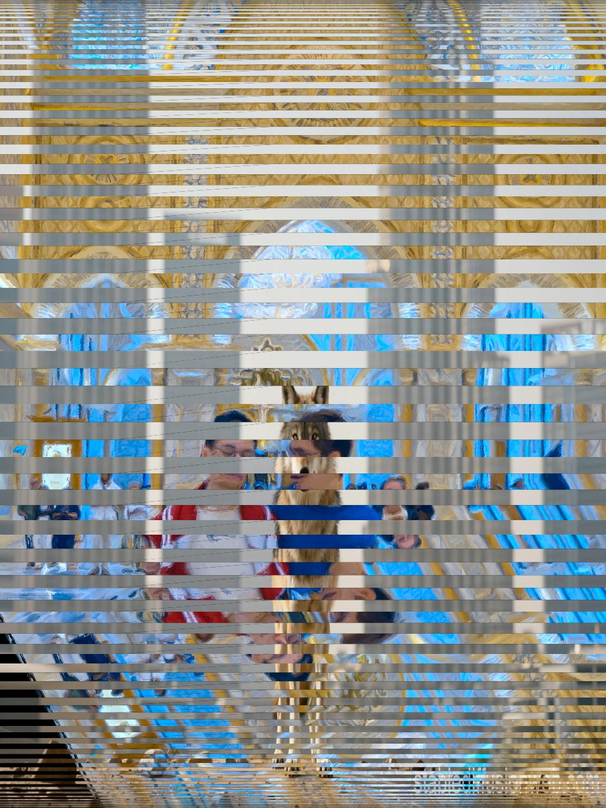
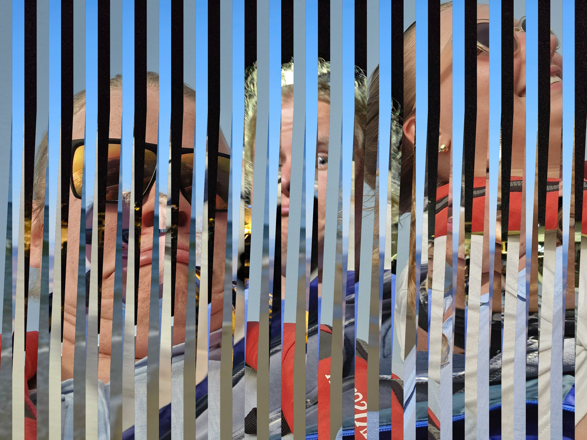
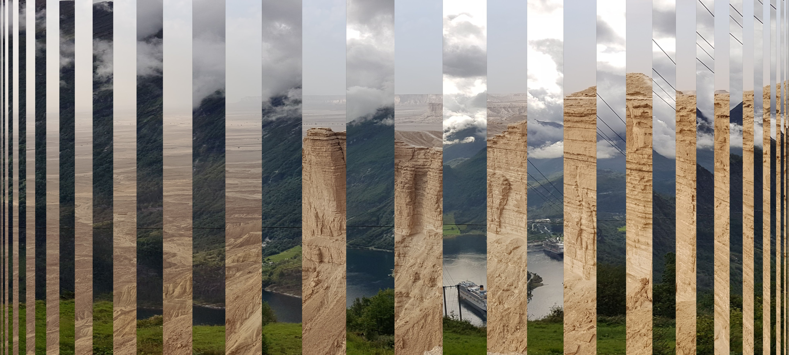

# Editor Roláží (Collage/Stripe Editor)

Tento nástroj umožňuje vytvářet vizuálně zajímavé roláže (proužkové koláže) ze dvou nebo více obrázků. Aplikace nabízí jak jednoduchý editor pro dva obrázky, tak pokročilý editor pro komplexnější kompozice s historií změn a možností ukládání projektů.

## 🚀 Základní návod k použití

### Klasický editor
1. **Nahrání obrázků:** Nahrajte dva obrázky (jeden jako podklad, druhý jako střídavý prvek).
2. **Nastavení proužků:** Pomocí posuvníku nastavte počet proužků.
3. **Výběr vzoru:** Zvolte, zda mají být proužky rovnoměrné, nebo se mají rozšiřovat/zužovat směrem ke středu.
4. **Směr:** Vyberte svislou nebo vodorovnou orientaci proužků.
5. **Export:** Stáhněte si výslednou roláž jako JPG.

### Pokročilý editor
1. **Více obrázků:** Můžete nahrát sudý počet obrázků (2, 4, 6, 8, nebo 10).
2. **Režim proužků:** 
   - *Střídavé:* Obrázky se pravidelně střídají v pořadí, v jakém byly nahrány.
   - *Párové:* Umožňuje definovat specifické dvojice obrázků pro každý proužek a rozdělit proužek diagonálně (pomocí počáteční a koncové hranice).
3. **Historie:** Kdykoliv se můžete vrátit zpět pomocí tlačítka "Zpět" nebo si prohlédnout log změn.
4. **Ukládání projektu:** Celý stav rozdělané práce včetně obrázků lze uložit do `.json` souboru a později jej znovu načíst.

## Soukromí a bezpečnost

Veškeré zpracování obrázků probíhá **výhradně lokálně ve vašem prohlížeči**. 
- Žádná data nejsou odesílána na server.
- Obrázky se neukládají do žádného cloudu.
- Funkce "Uložit projekt" vytvoří soubor přímo ve vaší paměti a nabídne jej ke stažení.

---
Autor: **Jakub Vlk**  
Zdrojový kód: [github.com/vlccek/rolaz](https://github.com/vlccek/rolaz)

## link na statistiky používání
- https://vlccek.goatcounter.com/

# Galerie

